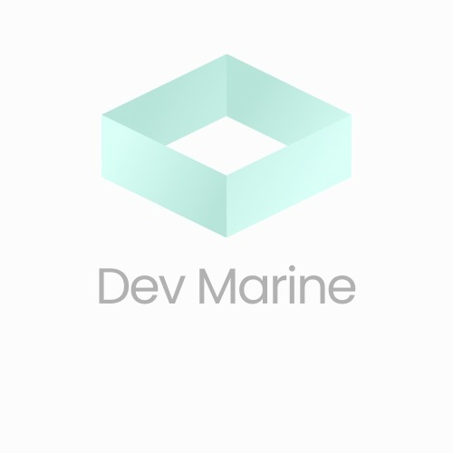
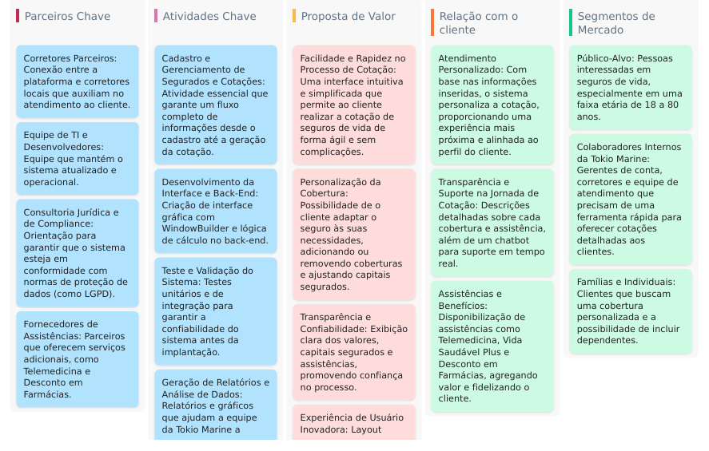

# Seguro de Vida - Dev Marine 🌊



Bem-vindo ao repositório do **Seguro de Vida**! 🚀 Este projeto é uma aplicação para gerenciar cotações de seguros com diversas funcionalidades.

---

## 👥 Colaboradores do Projeto


---

## 🖥️ Tela Inicial da Aplicação

Aqui está uma prévia da interface principal:


**Outra visão da interface principal:**


---

## 📖 Funcionalidades

- 📋 **Cadastro de Cotações**: Registre os dados de seguros de forma prática.
- 🔍 **Busca e Listagem de Seguros**: Pesquise rapidamente e visualize informações detalhadas.
- 📊 **Detalhamento de Ações**: Veja relatórios detalhados e históricos.

---

## 🛠️ Tecnologias Utilizadas

- ☕ **Java**: Para o backend da aplicação.
- ✍️ **Eclipse IDE**: Ambiente de desenvolvimento integrado.
- 🗄️ **Oracle Database**: Gerenciamento e armazenamento de dados.

---

## 🗂️ Documentação

Veja como a documentação foi estruturada para guiar o desenvolvimento:



---

## 🏗️ Arquitetura MVC

O projeto segue o padrão **MVC** (Model-View-Controller):


---

## 🗄️ Modelagem do Banco de Dados

Aqui está a modelagem utilizada para o banco de dados:


---

## 📦 Como Instalar e Executar

1. Clone o repositório:  
   ```bash
   git clone https://github.com/seu_usuario/SeguroDeVida.git
