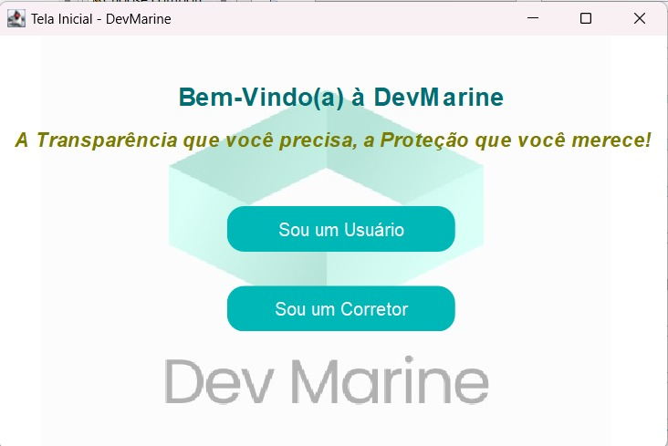
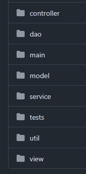
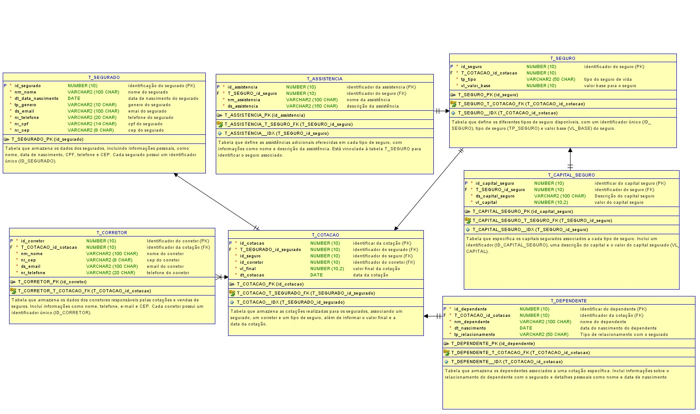

# Seguro de Vida - Aplicação

Bem-vindo ao repositório do **Seguro de Vida**! 🚀 Este projeto é uma aplicação para gerenciar cotações de seguros com diversas funcionalidades.

## Colaboradores do Projeto


## 🖥️ Tela Inicial da Aplicação

Aqui está uma prévia da interface principal:




## Arquitetura MVC




## 📖 Funcionalidades

- 📋 Cadastro de cotações.
- 🔍 Busca e listagem de seguros.
- 📊 Relatórios detalhados.

## 🛠️ Tecnologias Utilizadas

- **Java**
- **Eclipse IDE**
- **Oracle Database**

## 🗂️ Documentação

Abaixo, um exemplo de como a documentação do projeto foi estruturada:


## Modelagem do BancoDados




## 📦 Como Instalar e Executar

1. Clone o repositório:
   ```bash
   git clone https://github.com/seu_usuario/SeguroDeVida.git
